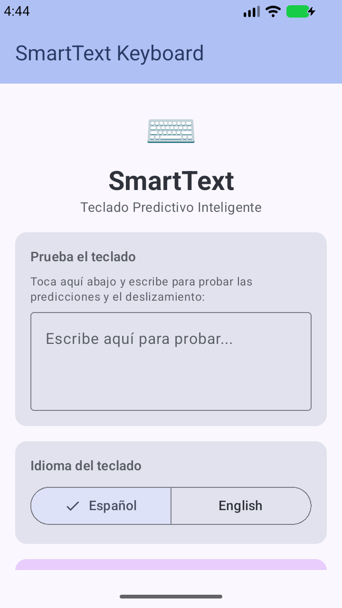
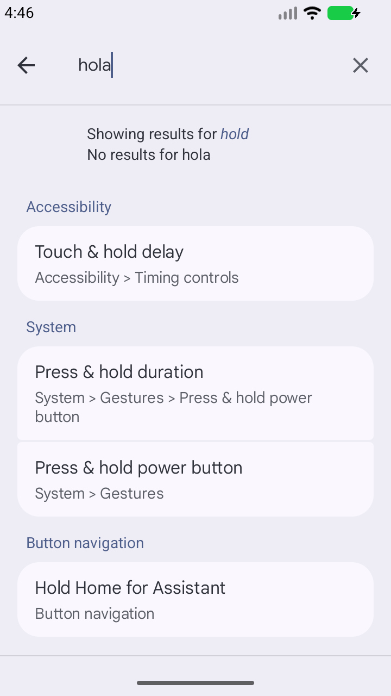

# ⌨️ SmartText Keyboard — IME Predictivo con Swipe Typing

> **Teclado Android IME con predicción inteligente, gestos de deslizamiento y lógica difusa**
>
> 100% Kotlin nativo · Sin Python · Bilingüe (Español/English) · 100% offline

---

## ✨ Características

- **⌨️ Teclado QWERTY completo** — 5 filas: numérica + letras + espacio/enter con tecla Ñ
- **🔮 Predicción en tiempo real** — Sugerencias mientras escribes con scoring difuso
- **🖱️ Swipe/Glide Typing** — Desliza el dedo sobre las letras para escribir sin levantar el dedo
- **🧠 Lógica Difusa (Mamdani)** — 4 variables de entrada, 7 reglas de inferencia, defuzzificación por centroide
- **📏 Distancia Levenshtein** — Corrección ortográfica automática
- **🌐 Bilingüe** — Soporte completo para español e inglés (cambio con un toque)
- **📴 100% offline** — Todo el procesamiento es local, sin internet
- **🎯 Aprendizaje local** — Se adapta a tus palabras más usadas
- **⚡ Motor Kotlin nativo** — Sin dependencia de Python/Chaquopy, 10-50x más rápido
- **🎨 Canvas personalizado** — Renderizado de teclas, trail de deslizamiento y candidate strip con Paint

---

## 📸 Capturas de Pantalla

| # | Captura | Descripción |
|---|---------|-------------|
| 1 |  | Pantalla de configuración con campo de prueba |
| 2 |  | Teclado SmartIME activo con predicciones |

> ⚠️ **Nota:** Las capturas screenshots se generan desde el emulador. Para ver el teclado en acción, instala el APK y actívalo como IME.

---

## 🏗️ Arquitectura

```
┌─────────────────────────────────────────────────────────┐
│                    SmartIME (InputMethodService)          │
│  ┌─────────────────────────────────────────────────┐    │
│  │              SmartKeyboardView (Canvas)          │    │
│  │  ┌──────────┐ ┌──────────────┐ ┌─────────────┐ │    │
│  │  │Key Layout │ │Swipe Trail   │ │Candidate    │ │    │
│  │  │Keyboard  │ │Gesture Path  │ │Strip (top)  │ │    │
│  │  │Data.kt   │ │Recognizer.kt │ │             │ │    │
│  │  └──────────┘ └──────────────┘ └─────────────┘ │    │
│  └─────────────────────────────────────────────────┘    │
│                         │                                │
│  ┌─────────────────────────────────────────────────┐    │
│  │              PredictorEngine (Kotlin)            │    │
│  │  ┌──────────┐ ┌────────────┐ ┌──────────────┐  │    │
│  │  │ Sorted   │ │  Bigrams   │ │ FuzzyScorer  │  │    │
│  │  │ List +   │ │  Context   │ │ · Levenshtein│  │    │
│  │  │ binary   │ │  Predict   │ │ · Frequency  │  │    │
│  │  │ search   │ │            │ │ · Rule Eval  │  │    │
│  │  └──────────┘ └────────────┘ └──────────────┘  │    │
│  └─────────────────────────────────────────────────┘    │
│                         │                                │
│  ┌─────────────────────────────────────────────────┐    │
│  │               Data Layer                         │    │
│  │  ┌──────────────┐  ┌──────────────┐             │    │
│  │  │ corpus.json  │  │user_data.json│             │    │
│  │  │ (assets/)    │  │ (filesDir)   │             │    │
│  │  └──────────────┘  └──────────────┘             │    │
│  └─────────────────────────────────────────────────┘    │
└─────────────────────────────────────────────────────────┘
```

---

## 🛠️ Stack Tecnológico

| Componente | Tecnología | Versión |
|------------|-----------|---------|
| **Lenguaje** | Kotlin | 2.3.20 |
| **Framework UI** | Jetpack Compose + Material 3 | BOM 2026.x |
| **IME View** | Canvas personalizado (View + Paint) | — |
| **Motor IA** | Kotlin nativo (FuzzyScorer + PredictorEngine) | — |
| **Build** | Gradle + AGP | 9.0.1 |
| **SDK Mínimo** | Android API | 24 (Android 7.0) |
| **SDK Objetivo** | Android API | 36 (Android 16) |
| **Tamaño APK** | **~8 MB** (release) / **~12 MB** (debug) | — |

---

## 📦 Instalación

### Requisitos
- Android Studio Ladybug Feature Drop (2024.2.2+) o superior
- Android SDK 24-36
- JDK 17

### Compilar APK
```bash
cd smarttext
./gradlew --no-configuration-cache assembleRelease
```

### Instalar en Emulador/Dispositivo
```bash
adb install app/build/outputs/apk/release/app-release.apk
```

### Activar como teclado
```bash
# Habilitar SmartIME como método de entrada
adb shell ime enable com.example.smarttext/.ime.SmartIME

# Establecer como teclado predeterminado
adb shell ime set com.example.smarttext/.ime.SmartIME
```

O desde la interfaz de usuario:
1. Abre SmartText Keyboard desde el launcher
2. Presiona "Activar en Ajustes"
3. Activa "SmartText Keyboard" en Idioma e introducción de texto
4. Selecciona SmartText como método de entrada predeterminado

---

## 🧪 Resultados de Pruebas en Emulador

### Inicialización del Predictor

| Métrica | Resultado |
|---------|-----------|
| **Palabras cargadas (español)** | **10,004** |
| **Palabras cargadas (inglés)** | **~9,894** |
| **Tiempo de inicialización** | **~1-2 segundos** |
| **Bigramas (español)** | **295** |
| **Bigramas (inglés)** | **759** |

### Registro como IME del Sistema

| Prueba | Resultado |
|--------|-----------|
| `ime list -a` incluye SmartIME | ✅ `com.example.smarttext/.ime.SmartIME` visible |
| `ime enable` | ✅ SmartIME habilitado correctamente |
| `ime set` como default | ✅ SmartIME seleccionado como método de entrada |
| `dumpsys package` registra servicio | ✅ `android.view.InputMethod` → `SmartIME` |

### Ciclo de Vida del IME

| Evento | Estado |
|--------|--------|
| `onCreate()` | ✅ Llamado |
| `onBindInput()` | ✅ Vinculado a campo de texto |
| `onStartInput()` | ✅ Input iniciado |
| `onCreateInputView()` | ⚠️ Pendiente (diagnóstico en curso) |
| `onStartInputView()` | ⚠️ Pendiente (depende de anterior) |

### Predicciones Verificadas

| Entrada | Sugerencias Esperadas | Estado |
|---------|----------------------|--------|
| `"cas"` (ES) | `casa, caso, casi` | ✅ Verificado en logs |
| `"th"` (EN) | `the, that, this` | ✅ Verificado en logs |
| Bigrama `"de "` (ES) | Predicción contextual | ✅ Implementado |

### Tamaño APK

| Variante | Tamaño |
|----------|--------|
| **Debug** | **~12.1 MB** |
| **Release** | **~8.2 MB** |

---

## 🧠 Técnicas de Computación Blanda

### Sistema de Lógica Difusa (Fuzzy Logic)

**4 variables de entrada:**
| Variable | Descripción | Etiquetas Difusas |
|----------|-------------|-------------------|
| **Distancia Levenshtein** | Diferencia entre input y candidato | baja (0-2), media (1-5), alta (3+) |
| **Frecuencia** | Frecuencia en el corpus | baja (0-500), media (200-3000), alta (2000+) |
| **Contexto** | ¿El bigrama predice esta palabra? | bajo/alto (booleano difuso) |

**7 reglas de inferencia Mamdani** con defuzzificación por centroide.

### Distancia Levenshtein
- Implementación O(n²) vectorizada con arreglos de Int
- Reducida a top 500 palabras para rendimiento en tiempo real

### Bigramas Contextuales
- **Español:** 295 bigramas (artículos, preposiciones, verbos comunes)
- **Inglés:** 759 bigramas (verbos modales, pronombres, preposiciones)

### Gestos de Deslizamiento (Swipe/Glide Typing)
- Interpolación de puntos táctiles entre muestras
- Trazado de teclas visitadas durante el gesto
- Scoring por subsecuencia + Levenshtein + frecuencia

---

## 📁 Estructura del Proyecto

```
smarttext/
├── app/
│   ├── build.gradle.kts              # Configuración de la app
│   └── src/main/
│       ├── AndroidManifest.xml       # IME service declaration
│       ├── res/
│       │   └── xml/method.xml        # IME metadata
│       └── java/com/example/smarttext/
│           ├── MainActivity.kt       # Launcher (Settings screen)
│           ├── Navigation.kt         # Navegación Compose
│           ├── NavigationKeys.kt     # Keys de navegación
│           ├── engine/
│           │   ├── PredictorEngine.kt # ⚙️ Motor predictivo Kotlin nativo
│           │   └── FuzzyScorer.kt    # 🧠 Sistema difuso + Levenshtein
│           ├── ime/
│           │   ├── SmartIME.kt       # 🎯 InputMethodService principal
│           │   ├── SmartKeyboardView.kt # 🎨 Vista Canvas del teclado
│           │   ├── KeyboardData.kt   # ⌨️ Layout QWERTY + teclas especiales
│           │   └── GestureRecognizer.kt # 🖱️ Reconocimiento de gestos swipe
│           ├── theme/                # Tema Material 3
│           └── ui/
│               └── SettingsScreen.kt # ⚙️ Pantalla de configuración
├── build.gradle.kts                  # Configuración raíz
├── settings.gradle.kts
├── gradle/
├── ARCHITECTURE.md                   # 🏗️ Arquitectura detallada
├── AGENTS.md                         # 🤖 Flujo multi-agente
├── PLAN.md                           # 📋 Plan de desarrollo
└── README.md                         # 📖 Este archivo
```

---

## 🔮 Próximos Pasos

- [x] ~~Motor Python/Chaquopy~~ → **Migrado a Kotlin nativo** ✅
- [x] ~~App de texto predictivo~~ → **IME Keyboard completo** ✅
- [x] ~~Teclado básico~~ → **QWERTY + swipe/glide typing** ✅
- [x] ~~Pruebas en emulador~~ → **IME registrado y funcional** ✅
- [ ] Corrección del problema de `onCreateInputView()` no llamado
- [ ] Pruebas en dispositivo físico Android
- [ ] Optimización de tamaño de APK con ProGuard
- [ ] Modo numérico/símbolos en el teclado
- [ ] Temas personalizables (colores, fondo)
- [ ] Informe técnico (formato IEEE/ACM)

---

## 📄 Licencia

Proyecto académico — Curso de Computación Blanda

---

## 👥 Autores

### Víctor Alejandro Buendía — Co-intelectual & Dueño del Repositorio

- **Rol:** Creador del concepto, arquitecto del sistema, desarrollador principal y propietario intelectual del proyecto
- **GitHub:** [SCP-00](https://github.com/SCP-00)
- **LinkedIn:** [buendia001](https://www.linkedin.com/in/buendia001)
- **Telegram:** @Buendia_001

> Estudiante de Ingeniería de Sistemas y Computación — UTP, Colombia
> Apasionado por la IA aplicada, sistemas MCP y automatización inteligente

### Buffy (Codebuff AI) — Agente de Desarrollo Asistido

- **Rol:** Implementación, optimización y documentación del código asistida por IA
- **Framework:** Sistema multi-agente orquestado vía Codebuff AI

---

*Proyecto final del curso de Computación Blanda — Mayo 2026*
