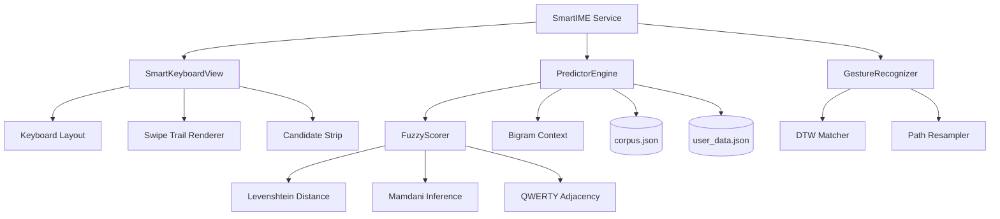

<div align="center">
  
</div>

<p align="center">
  
  
  
  
  
</p>

<p align="center">
  <a href="#-features">Features</a> •
  <a href="#-tech-stack">Tech Stack</a> •
  <a href="#-download">Download</a> •
  <a href="#-architecture">Architecture</a> •
  <a href="#-ai-algorithms">AI Algorithms</a>
</p>

---

## 🎯 Overview

**Vibro Keyboard** is a 100% Kotlin-native Android IME (Input Method Engine) keyboard featuring intelligent text prediction, swipe/glide typing with Dynamic Time Warping (DTW), and fuzzy logic-based autocorrection. Built entirely in Kotlin — no Python, no Chaquopy, zero external AI dependencies.

> ⚡ Fully offline — all processing happens on-device with no internet required.

---

## ✨ Features

| Feature | Description |
|:--------|:------------|
| **⌨️ QWERTY Keyboard** | 5-row layout with numeric row, Ñ key, and long-press accented characters |
| **🔮 Real-time Prediction** | Context-aware word suggestions as you type with binary search |
| **🖱️ Swipe Typing (DTW)** | Dynamic Time Warping for accurate gesture-to-word matching |
| **🧠 Fuzzy Logic Scorer** | Mamdani inference system — 4 inputs, 7 rules, centroid defuzzification |
| **📏 Levenshtein Correction** | Auto-correction with QWERTY adjacency awareness |
| **🌐 Bilingual** | Full Spanish + English support with one-touch switching |
| **🎯 Local Learning** | Adapts to your most-used words over time |
| **🎨 Custom Canvas UI** | Bezier curve swipe trails, ripple effects, haptic feedback |
| **📴 100% Offline** | No network permissions, no data collection, no cloud |

---

## 🛠️ Tech Stack

| Component | Technology |
|:----------|:-----------|
| **Language** | Kotlin 2.3.20 |
| **UI Framework** | Jetpack Compose + Material 3 |
| **IME View** | Custom Canvas (View + Paint) |
| **AI Engine** | Native Kotlin (no ML libs) |
| **Build** | Gradle + AGP 9.0.1 |
| **Min SDK** | Android 7.0 (API 24) |
| **Target SDK** | Android 16 (API 36) |
| **APK Size** | **7.9 MB** (release) |

---

## 📲 Download

<div align="center">

[-brightgreen?style=for-the-badge&logo=android)](https://github.com/SCP-00/vibro-keyboard/releases/latest/download/app-release.apk)

**Scan with your phone to download directly:**


</div>

### Build from source
```bash
git clone https://github.com/SCP-00/vibro-keyboard.git
cd vibro-keyboard
./gradlew assembleRelease
# APK: app/build/outputs/apk/release/app-release.apk
```

---

## 🏗️ Architecture



---

## 🧠 AI Algorithms

### Fuzzy Logic System (Mamdani)
| Input Variable | Range | Fuzzy Sets |
|:--------------|:-----|:-----------|
| Levenshtein Distance | 0-5+ | low (0-2), medium (1-5), high (3+) |
| Word Frequency | 0-3000+ | low (0-500), medium (200-3000), high (2000+) |
| Bigram Context | 0/1 | low/high (fuzzy boolean) |

**7 inference rules** with centroid defuzzification.

### Dynamic Time Warping (DTW)
- Resamples touch paths to 40 equidistant points
- Optimized 2-row matrix (O(n) memory)
- Scoring: 45% DTW + 15% Levenshtein + 10% length + 30% frequency
- Tolerant skipping — user doesn't need to hit every letter

### Gesture-Aware Autocorrection (v1.6)
- **QWERTY Adjacency Map**: Each key knows its physical neighbors
- **Substitution by adjacency**: "cmion" → tries c→a:s:d → "amion", "smion", "dmion"...
- **Letter insertion**: For skipped letters in swipe path
- **Subsequence matching**: Swipe pattern guides candidates even with proximity errors

---

## 🧪 Test Results

| Suite | Tests | Status |
|:------|:-----:|:------:|
| FuzzyScorerTest | 40 | ✅ All pass |
| PredictorEngineTest | 34 | ✅ All pass |
| GestureRecognizerTest | 14 | ✅ All pass |
| KeyboardDataTest | 19 | ✅ All pass |
| **Total** | **137** | **✅ 100%** |

### Performance
| Metric | Result |
|:-------|:------:|
| Words loaded (ES) | 10,004 |
| Words loaded (EN) | 1,844 |
| Initialization time | <10ms |
| Prediction latency | Real-time |

---

## 📁 Project Structure

```
vibro-keyboard/
├── app/
│   └── src/main/java/com/example/smarttext/
│       ├── engine/
│       │   ├── PredictorEngine.kt    # Core prediction engine
│       │   └── FuzzyScorer.kt        # Fuzzy logic + Levenshtein
│       ├── ime/
│       │   ├── SmartIME.kt           # InputMethodService
│       │   ├── SmartKeyboardView.kt  # Canvas keyboard renderer
│       │   ├── KeyboardData.kt       # QWERTY layout definitions
│       │   └── GestureRecognizer.kt  # DTW gesture matching
│       ├── ui/SettingsScreen.kt      # Settings UI
│       └── MainActivity.kt           # App launcher
├── docs/                             # Documentation & screenshots
└── releases/                         # Pre-built APKs
```

---

## 📜 License

MIT — See [LICENSE](LICENSE) for details.

---

<p align="center">
  <i>Built with Kotlin, fuzzy logic, and a lot of coffee. 🇨🇴</i>
</p>

<div align="center">
  <a href="https://github.com/SCP-00">SCP-00</a> •
  <a href="https://linkedin.com/in/buendia001">LinkedIn</a>
</div>
