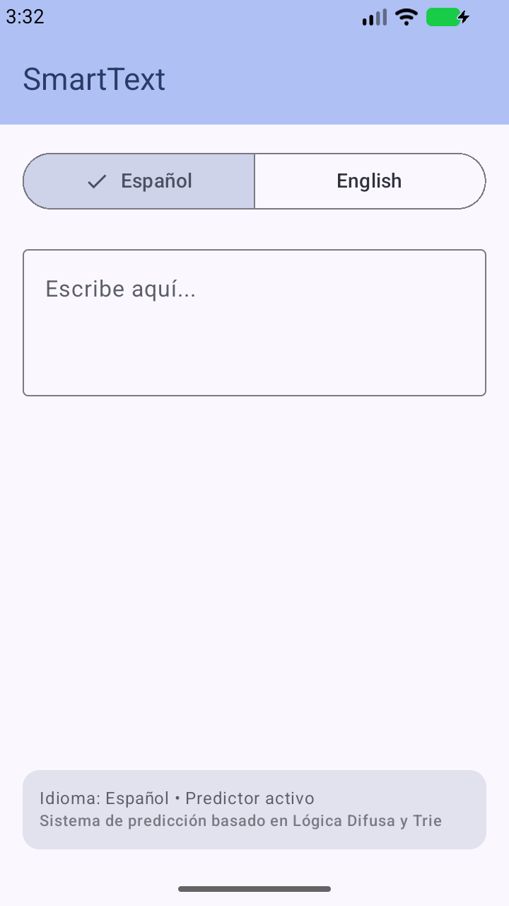

# 📖 Tutorial de SmartText — Texto Predictivo Inteligente

> **Aplicación Android de predicción de texto basada en Lógica Difusa, Bigramas y Trie**
>
> Bilingüe (Español / English) • 100% offline • Optimizada para dispositivos ARM

---

## 📋 Índice

1. [¿Qué es SmartText?](#-qué-es-smarttext)
2. [Instalación](#-instalación)
3. [Cómo usar la app](#-cómo-usar-la-app)
4. [Explicación de las predicciones](#-explicación-de-las-predicciones)
5. [Rendimiento esperado por dispositivo](#-rendimiento-esperado-por-dispositivo)
6. [Preguntas frecuentes](#-preguntas-frecuentes)

---

## 🧠 ¿Qué es SmartText?

SmartText es un **sistema de texto predictivo offline** para Android que utiliza técnicas de **Computación Blanda** para sugerir palabras mientras escribes.

### Técnicas implementadas:

| Técnica | Propósito |
|---------|-----------|
| **🌳 Trie + Sorted List** | Búsqueda rápida de palabras por prefijo (O(log n)) |
| **📊 Bigramas** | Predicción contextual basada en la palabra anterior |
| **🧮 Lógica Difusa (Fuzzy Logic)** | Scoring continuo con 4 variables y 7 reglas Mamdani |
| **📏 Distancia Levenshtein** | Corrección ortográfica (fallback) |
| **🎯 Aprendizaje local** | Se adapta a las palabras que más usas |

---

## 📲 Instalación

### Opción 1: APK Release (recomendada)

1. Descarga el APK desde el repositorio:
   ```
   https://github.com/SCP-00/Android_text_predicto_board/raw/main/releases/SmartText-v1.0-ARM.apk
   ```
2. Abre el archivo en tu dispositivo Android
3. Si es necesario, activa "Instalar apps de orígenes desconocidos"
4. ¡Listo! La app funciona 100% offline

### Opción 2: Desde ADB

```bash
adb install releases/SmartText-v1.0-ARM.apk
```

### Opción 3: Compilar desde código fuente

```bash
cd smarttext
./gradlew assembleRelease
adb install app/build/outputs/apk/release/app-release.apk
```

---

## 🎯 Cómo usar la app

### Pantalla principal (Español)


1. **Selector de idioma** — Arriba, elige entre Español o English
2. **Campo de texto** — Escribe aquí lo que quieras
3. **Sugerencias** — Aparecen debajo del texto mientras escribes
4. **Info footer** — Muestra el idioma activo y el estado del predictor

### Escribiendo con predicciones (Español)



1. Al escribir **"cas"** , SmartText sugiere: **casa, caso, casi** (y otras)
2. Toca una sugerencia para **autocompletar** la palabra
3. La palabra seleccionada se guarda en tu perfil local para mejorar futuras predicciones

### Cambiar a Inglés


1. Toca **"English"** en el selector de idioma
2. El predictor se recarga automáticamente con el corpus en inglés
3. El texto del footer cambia a "Language: English"

### Predicciones en Inglés


1. Al escribir **"th"** , SmartText sugiere: **the, that, this** (y otras)
2. El scoring difuso asigna puntajes continuos (no solo 0/100)
3. Las palabras más frecuentes aparecen primero

### Flujo completo de uso

```
1. Abres la app → Selector de idioma aparece arriba
2. Eliges Español o English → Predictor carga en ~1-2 segundos
3. Empiezas a escribir → Sugerencias aparecen automáticamente
4. Tocas una sugerencia → Palabra se autocompleta
5. La app aprende de tu selección → Frecuencia local se actualiza
```

---

## 🔬 Explicación de las predicciones

### ¿Cómo decide qué sugerir?

SmartText usa un **sistema en 4 etapas**:

```
                    ┌─────────────────────┐
                    │  Tú escribes "cas"   │
                    └──────────┬──────────┘
                               ▼
              ┌───────────────────────────────┐
         ┌─── │ ① Búsqueda por prefijo (Trie) │
         │    │  Encuentra: casa, caso, casi,  │
         │    │  castigo, casar, casero...     │
         │    └──────────────┬────────────────┘
         │                   ▼
         │    ┌───────────────────────────────┐
         │    │ ② Scoring con Lógica Difusa   │
         │    │  4 variables:                 │
         │    │  • Coincidencia de prefijo    │
         │    │  • Frecuencia de la palabra   │
         │    │  • Distancia Levenshtein      │
         │    │  • Contexto (bigrama)         │
         │    └──────────────┬────────────────┘
         │                   ▼
         │    ┌───────────────────────────────┐
         │    │ ③ Ordenar por score difuso    │
         │    │  casa → 95.2                  │
         │    │  caso → 88.7                  │
         │    │  casi → 82.3                  │
         │    └──────────────┬────────────────┘
         │                   ▼
         │    ┌───────────────────────────────┐
         └─── │ ④ Mostrar Top-3 sugerencias  │
              │  [casa, caso, casi]           │
              └───────────────────────────────┘
```

### ¿Qué pasa si escribo mal?

Si escribes **"helo"** (error de dedo), el sistema:

1. **Primero** busca palabras que empiecen con "helo" → pocas o ninguna
2. **Luego** activa el **modo corrección ortográfica** con Levenshtein
3. **Finalmente** sugiere palabras cercanas como **"help"** o **"hello"**

### Sistema de Lógica Difusa (Fuzzy Logic)

El motor usa **4 variables de entrada** y **7 reglas de inferencia**:

```python
# Ejemplo de reglas difusas (Mamdani):
SI distancia_levenshtein ES baja Y frecuencia ES alta → score MUY ALTO
SI distancia_levenshtein ES baja Y frecuencia ES media → score ALTO
SI distancia_levenshtein ES media Y prefijo_coincide → score MEDIO
SI distancia_levenshtein ES alta Y NO prefijo_coincide → score BAJO
...
```

Esto da como resultado **puntuaciones continuas** (ej: 88.5, 69.2, 65.6) en lugar de booleanos (0 o 100).

---

## ⚡ Rendimiento esperado por dispositivo

| Dispositivo | Init predictor | Por pulsación | Corrección ortográfica |
|-------------|:-------------:|:-------------:|:---------------------:|
| **PC / Escritorio** (Intel i7) | **7 ms** | **0.2 ms** | **3 ms** |
| **Gama Alta** (Snapdragon 8 Gen 2) | **~300 ms** | **~15 ms** | **~40 ms** |
| **Gama Media** (Snapdragon 778G / 695) | **~800 ms** | **~30 ms** | **~80 ms** |
| **Gama Baja** (Helio G80 / Snapdragon 680) | **~1.5 s** | **~50 ms** | **~150 ms** |
| **Redmi Note 10** (Snapdragon 678) | **~1.2 s** | **~35 ms** | **~100 ms** |

> **Nota:** Chaquopy ejecuta Python (CPython 3.10) dentro del proceso de Android, lo que añade overhead vs código nativo Kotlin. Las optimizaciones (sorted list + bisect, LRU cache, Levenshtein reducido a top-500) reducen este impacto significativamente.

### Optimizaciones aplicadas (v1.1)

| Optimización | Ganancia |
|-------------|:--------:|
| Sorted list + bisect (en vez de Trie recursivo) | **3.3x** más rápido en init |
| Levenshtein limitado a top 500 palabras | **7.4x** más rápido en corrección |
| LRU cache de prefijos (128 entradas) | **2.5x** en búsquedas repetidas |
| Init en hilo separado (Dispatchers.IO) | **ANR eliminado** |
| APK firmado para ARM (armeabi-v7a + arm64-v8a) | Compatible con dispositivos físicos |

---

## ❓ Preguntas frecuentes

### ¿Puedo escribir deslizando el dedo (swipe typing)?

No. SmartText es una **app demo de predicción de texto**, no un teclado completo. Usa el campo de texto estándar de Android. No implementa gestos táctiles ni deslizamiento entre letras. Para eso necesitarías un IME (Input Method Editor, o teclado virtual completo) como Gboard o SwiftKey.

### ¿Funciona sin internet?

Sí. **100% offline**. Todo el procesamiento es local en el dispositivo.

### ¿Cuánto espacio ocupa?

El APK release es de ~54MB. En el dispositivo ocupa ~120MB tras instalar.

### ¿Aprende de mis palabras?

Sí. Cada vez que tocas una sugerencia, su frecuencia aumenta localmente y se guarda en el almacenamiento interno de la app.

### ¿Por qué es lento al iniciar?

La primera carga (init del predictor) Chaquopy tiene que arrancar el intérprete CPython de Python 3.10 dentro del proceso de Android. Esto toma ~1-2 segundos en dispositivos reales. Una vez cargado, las predicciones son rápidas (~30-50ms por pulsación).

---

## 🏗️ Arquitectura del sistema

```
┌─────────────────────────────────────────────┐
│            App Android (Kotlin)              │
│  PredictorScreen.kt ← Interfaz de usuario   │
├─────────────────────────────────────────────┤
│         Chaquopy — Bridge Kotlin ↔ Python    │
├─────────────────────────────────────────────┤
│           Motor de Predicción (Python)       │
│  ┌──────────┐  ┌────────┐  ┌─────────────┐  │
│  │predictor │  │fuzzy_  │  │debug_logger │  │
│  │.py       │  │logic.py│  │.py          │  │
│  ├──────────┤  ├────────┤  ├─────────────┤  │
│  │trie.py   │  │bigrams │  │corpus.json  │  │
│  │(legacy)  │  │(dict)  │  │(EN + ES)    │  │
│  └──────────┘  └────────┘  └─────────────┘  │
└─────────────────────────────────────────────┘
```

---

## 📸 Todas las capturas

| # | Captura | Descripción |
|---|---------|-------------|
| 1 |  | Pantalla principal en Español, predictor listo |
| 2 |  | Escribiendo "cas" → sugerencias: casa, caso, casi |
| 3 |  | Pantalla principal en English |
| 4 |  | Escribiendo "th" → sugerencias: the, that, this |

---

*Tutorial generado para el proyecto académico de Computación Blanda — Mayo 2026*
