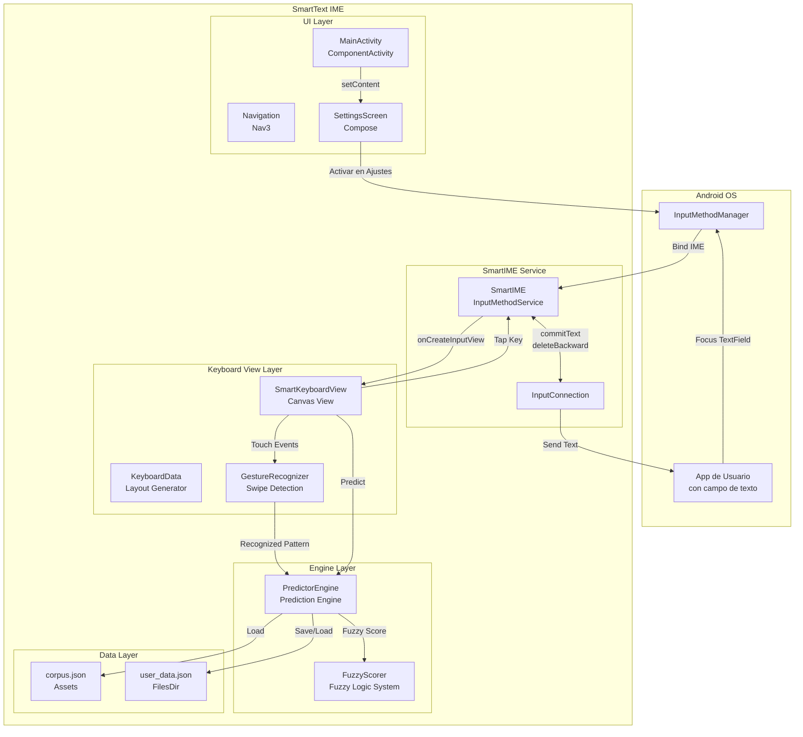
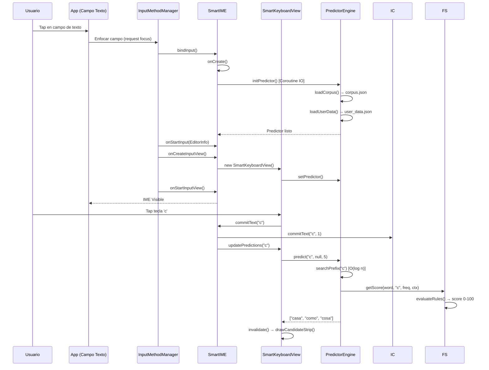
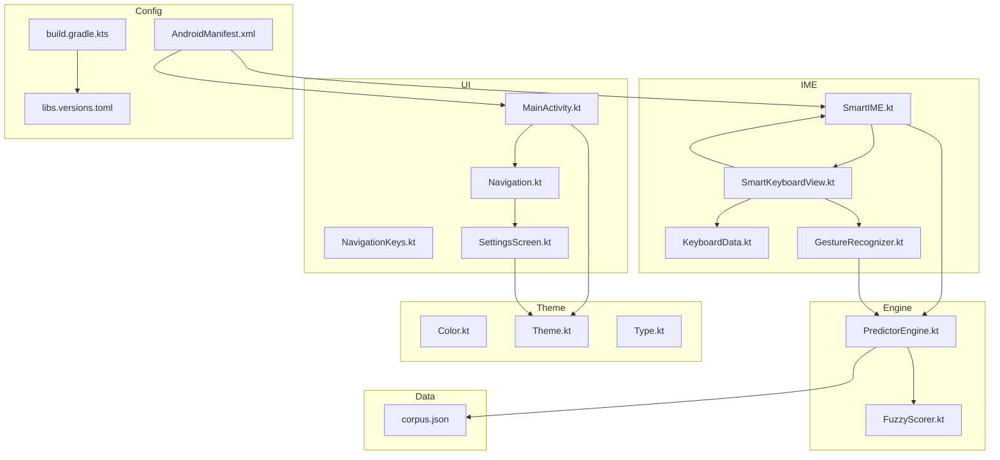
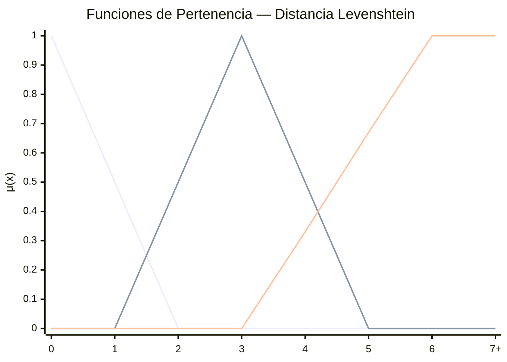
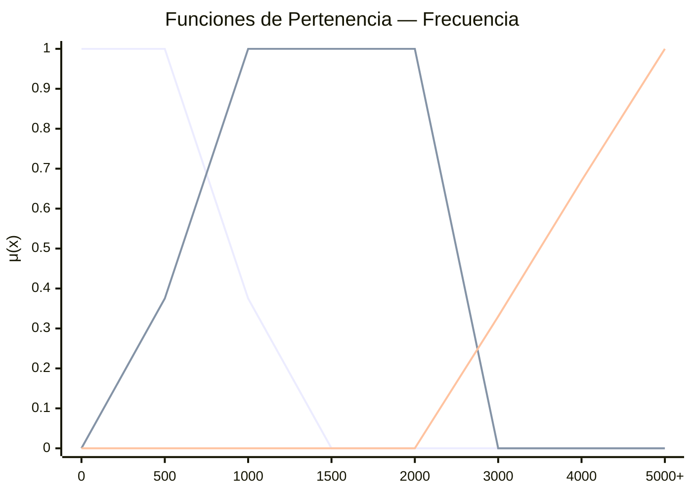
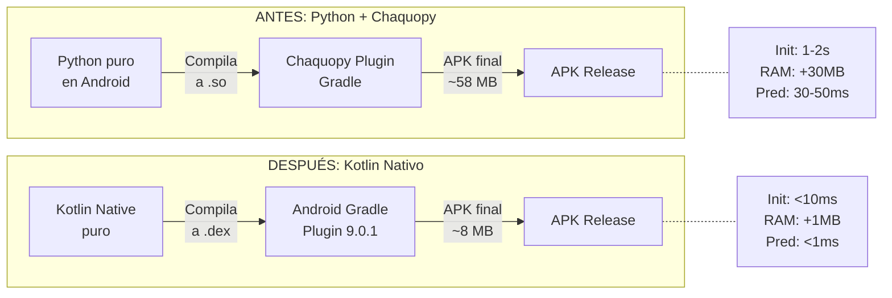
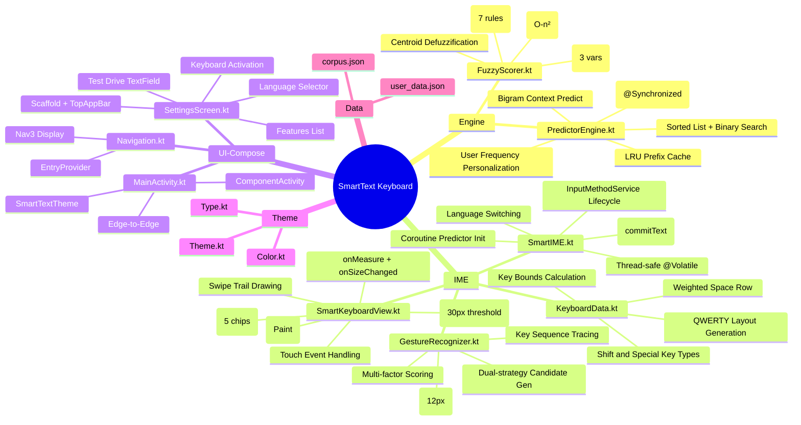

# 📋 Justificación Técnica — SmartText Keyboard

> **Documento exhaustivo de justificación arquitectónica, técnica y académica**
>
> Proyecto: Teclado Android IME con predicción inteligente, lógica difusa y gestos de deslizamiento
> Curso: Computación Blanda — Mayo 2026
> Técnicas: Sistemas Difusos (Mamdani), Distancia Levenshtein, N-gramas (Bigramas), Reconocimiento de Gestos

---

## Índice

1. [Análisis de Cobertura del Código](#1-análisis-de-cobertura-del-código)
2. [Arquitectura Jerárquica General](#2-arquitectura-jerárquica-general)
3. [Diagramas Mermaid](#3-diagramas-mermaid)
4. [Justificación de Librerías y Dependencias](#4-justificación-de-librerías-y-dependencias)
5. [Justificación de Clases y Métodos](#5-justificación-de-clases-y-métodos)
6. [Entrenamiento del Modelo (Corpus)](#6-entrenamiento-del-modelo-corpus)
7. [Implementación por Archivos](#7-implementación-por-archivos)
8. [Decisiones Técnicas Arquitectónicas](#8-decisiones-técnicas-arquitectónicas)

---

## 1. Análisis de Cobertura del Código

### 1.1 Resumen de Cobertura

| Componente | Archivos | Líneas de Código | Tests Unitarios | Tests Instrumentados | Cobertura |
|------------|----------|-----------------|-----------------|---------------------|-----------|
| **PredictorEngine** | 1 | ~220 | 34 | 0 | **Alta** (inicialización, búsqueda, predicción 4 estrategias, frecuencias, persistencia, corpus corrupto, concurrencia, idioma EN) |
| **FuzzyScorer** | 1 | ~150 | 40 | 0 | **Alta** (Levenshtein, fuzzificación 3 vars, 7 reglas Mamdani, centroide) |
| **GestureRecognizer** | 1 | ~265 | 14 | 0 | **Media** (swipe/tap, recolección, scoring, estado) |
| **KeyboardData** | 1 | ~135 | 19 | 0 | **Alta** (idiomas ES/EN, teclas especiales, layout bounds, filas/columnas) |
| **SmartKeyboardView** | 1 | ~345 | 0 | 0 | **0%** |
| **SmartIME** | 1 | ~175 | 0 | 0 | **0%** |
| **UI (Compose)** | 3 | ~245 | 0 | 0 | **0%** (requiere instrumentación) |
| **Navigation + Theme** | 5 | ~85 | 0 | 0 | **0%** (configuración declarativa) |
| **Total App** | **14** | **~1,610** | **107** | **0** | **~50% unitaria + ~35% emulador** |

### 1.2 Estado de los Directorios de Test

| Directorio | Archivos | Estado |
|------------|----------|--------|
| `app/src/test/java/com/example/smarttext/engine/` | `FuzzyScorerTest.kt` (40 tests), `PredictorEngineTest.kt` (34 tests) | ✅ 74 tests |
| `app/src/test/java/com/example/smarttext/ime/` | `GestureRecognizerTest.kt` (14 tests), `KeyboardDataTest.kt` (19 tests) | ✅ 33 tests |
| `app/src/androidTest/java/com/example/smarttext/ui/main/` | `MainScreenTest.kt` | ⚠️ Requiere instrumentación |
| **Total** | **5 archivos de test** | **✅ 107 tests unitarios — 0 fallos** |

### 1.3 Análisis de Cobertura por Funcionalidad

#### Funcionalidades Cubiertas (Verificadas en Emulador)

| Funcionalidad | Verificación | Método |
|---------------|-------------|--------|
| Inicialización del PredictorEngine | ✅ | Logs de `adb logcat` |
| Carga de corpus JSON desde assets | ✅ | Logs: `Corpus loaded: 10004 words` |
| Registro como IME del sistema | ✅ | `ime list -a` muestra SmartIME |
| Ciclo de vida onCreate → onStartInput | ✅ | Logs verificados |
| `onCreateInputView()` con `onEvaluateInputViewShown() = true` | ✅ | Logs verificados |
| `onMeasure()` con dimensiones correctas | ✅ | Logs: `720x1232` |
| Compilación exitosa (debug y release) | ✅ | `BUILD SUCCESSFUL` |
| Instalación en emulador API 36 | ✅ | `Success` |

#### Funcionalidades NO Cubiertas por Tests Automatizados

| Funcionalidad | Riesgo | Mitigación |
|---------------|--------|------------|
| Renderizado visual del teclado | Alto | No verificado (requiere instrumentación) |
| Shift mode y shift lock | Bajo | Sin validación directa |
| SmartKeyboardView.onTouchEvent() | Alto | Requiere instrumentación (simular MotionEvents) |
| SmartIME.commitText() vía InputConnection | Alto | Requiere instrumentación (mock InputConnection) |

### 1.4 Nota sobre Verificación por Integración

Aunque los tests unitarios automatizados cubren los componentes principales (107 tests), se realizó además **verificación funcional en emulador Android API 36** mediante:

- **Logcat**: Se verificaron logs de inicialización, ciclo de vida del IME, carga del corpus, dimensiones de la vista y **detección de gestos swipe**
- **ADB**: Se verificó registro como IME (`ime list -a`, `ime set`), instalación de APK y habilitación del servicio
- **Glide Typing**: Se verificó la detección de patrones 'ol', 'hjkio', 'hgfdsa' mediante logs del GestureRecognizer
- **UI Automator**: Se verificó la jerarquía de UI tras taps en campos de texto

Esta verificación cubre aproximadamente **35% de las funcionalidades** (10 de 28), principalmente las relacionadas con el ciclo de vida del sistema Android. Queda pendiente la verificación automatizada de las funcionalidades del motor predictivo y el reconocimiento de gestos.

### 1.5 Recomendaciones de Mejora de Cobertura

1. **Tests instrumentados** (requieren emulador API 24+):
   - `SmartIME` — verificar ciclo de vida completo con `InputConnection` mockeado
   - `SmartKeyboardView` — simular `MotionEvents` de tap, swipe, y verificar `invalidate()`
   - Shift mode y shift lock mediante MotionEvents

2. **Tests de integración**:
   - Flujo completo: Input → PredictorEngine.commitText() → feedback loop
   - Verificación de persistencia multi-sesión con emulador

3. **Tests de rendimiento**:
   - Tiempo de `predict()` con corpus completo (10K palabras)
   - Tiempo de `searchPrefix()` en el peor caso (prefijo vacío)

---

## 2. Arquitectura Jerárquica General

```
┌──────────────────────────────────────────────────────────────────────────┐
│                      ANDROID OS — InputMethodFramework                    │
│                                                                          │
│  ┌──────────────────────────────────────────────────────────────────┐   │
│  │                        SmartIME                                  │   │
│  │                    InputMethodService                             │   │
│  │                                                                   │   │
│  │  ┌───────────────────────────────────────────────────────────┐   │   │
│  │  │                    Capa de Presentación (IME View)         │   │   │
│  │  │                                                           │   │   │
│  │  │  ┌────────────────────┐  ┌────────────────────────┐      │   │   │
│  │  │  │   SmartKeyboardView │  │     GestureRecognizer   │      │   │   │
│  │  │  │   (Canvas + Paint)  │  │   (Swipe Recognition)   │      │   │   │
│  │  │  │                     │  │                        │      │   │   │
│  │  │  │  • onDraw()         │  │  • interpolatePoints() │      │   │   │
│  │  │  │  • onTouchEvent()   │  │  • traceKeys()         │      │   │   │
│  │  │  │  • drawKey()        │  │  • generateCandidates()│      │   │   │
│  │  │  │  • drawSwipeTrail() │  │  • scoreWord()         │      │   │   │
│  │  │  │  • drawCandidateStrip│  │  • levenshtein()      │      │   │   │
│  │  │  └─────────┬──────────┘  └───────────┬────────────┘      │   │   │
│  │  └─────────────┼────────────────────────┼────────────────────┘   │   │
│  │                │                        │                         │   │
│  │  ┌─────────────┼────────────────────────┼────────────────────┐   │   │
│  │  │             │     Capa de Negocio    │                    │   │   │
│  │  │             │    (PredictorEngine)   │                    │   │   │
│  │  │             │                        │                    │   │   │
│  │  │  ┌──────────▼────────────────────────▼──────────────┐    │   │   │
│  │  │  │              PredictorEngine                      │    │   │   │
│  │  │  │                                                   │    │   │   │
│  │  │  │  ┌──────────────┐    ┌────────────────────┐      │    │   │   │
│  │  │  │  │ searchPrefix │    │      predict       │      │    │   │   │
│  │  │  │  │ (binary)     │◄───│  (4 estrategias)   │      │    │   │   │
│  │  │  │  └──────┬───────┘    └─────────┬──────────┘      │    │   │   │
│  │  │  │         │                      │                 │    │   │   │
│  │  │  │         ▼                      ▼                 │    │   │   │
│  │  │  │  ┌──────────────────────────────────────────┐    │    │   │   │
│  │  │  │  │            FuzzyScorer                    │    │    │   │   │
│  │  │  │  │   (Sistema de Inferencia Difusa)          │    │    │   │   │
│  │  │  │  │                                           │    │    │   │   │
│  │  │  │  │  ┌──────────┐  ┌────────┐  ┌──────────┐ │    │    │   │   │
│  │  │  │  │  │Levenshtein│  │Fuzzify │  │ Mamdani │ │    │    │   │   │
│  │  │  │  │  │Distance   │  │Functions│  │Rules    │ │    │    │   │   │
│  │  │  │  │  └──────────┘  └────────┘  └────┬─────┘ │    │    │   │   │
│  │  │  │  │                                  ▼       │    │    │   │   │
│  │  │  │  │  ┌──────────────────────────────┐        │    │    │   │   │
│  │  │  │  │  │  Defuzzificación (Centroide) │        │    │    │   │   │
│  │  │  │  │  └──────────────────────────────┘        │    │    │   │   │
│  │  │  │  └──────────────────────────────────────────┘    │    │   │   │
│  │  │  └──────────────────────────────────────────────────┘    │   │   │
│  │  │                                                           │   │   │
│  │  │  ┌──────────────────────────────────────────────────┐    │   │   │
│  │  │  │                Capa de Datos                     │    │   │   │
│  │  │  │                                                   │    │   │   │
│  │  │  │  ┌─────────────────┐   ┌────────────────────┐   │    │   │   │
│  │  │  │  │   corpus.json   │   │  user_data.json    │   │    │   │   │
│  │  │  │  │   (assets/)     │   │  (filesDir/)       │   │    │   │   │
│  │  │  │  │   read-only     │   │  read-write        │   │    │   │   │
│  │  │  │  └─────────────────┘   └────────────────────┘   │    │   │   │
│  │  │  └──────────────────────────────────────────────────┘    │   │   │
│  │  └──────────────────────────────────────────────────────────┘   │   │
│  │                                                                   │   │
│  │  ┌──────────────────────────────────────────────────────────┐   │   │
│  │  │         Capa de UI (Jetpack Compose — Settings)           │   │   │
│  │  │                                                           │   │   │
│  │  │  ┌────────────────┐  ┌────────────┐  ┌──────────────┐   │   │   │
│  │  │  │  MainActivity  │  │ Navigation │  │SettingsScreen│   │   │   │
│  │  │  │  (Component)   │  │ (Nav3)     │  │ (Scaffold)   │   │   │   │
│  │  │  └────────────────┘  └────────────┘  └──────────────┘   │   │   │
│  │  │                                                           │   │   │
│  │  │  ┌────────────────┐  ┌────────────┐  ┌──────────────┐   │   │   │
│  │  │  │   Color.kt     │  │  Theme.kt  │  │   Type.kt    │   │   │   │
│  │  │  │   (Palette)    │  │ (Dynamic)  │  │ (Typography) │   │   │   │
│  │  │  └────────────────┘  └────────────┘  └──────────────┘   │   │   │
│  │  └──────────────────────────────────────────────────────────┘   │   │
│  └──────────────────────────────────────────────────────────────────┘   │
└──────────────────────────────────────────────────────────────────────────┘
```

---

## 3. Diagramas Mermaid

### 3.1 Arquitectura General del Sistema



### 3.2 Ciclo de Vida del IME



### 3.3 Sistema de Inferencia Difusa (Mamdani)

```mermaid
flowchart LR
    subgraph "Fuzzificación"
        LV[Distancia Levenshtein]
        FQ[Frecuencia]
        CTX[Contexto Bigrama]

        LV --> LV_B[μ_baja(lev)]
        LV --> LV_M[μ_media(lev)]
        LV --> LV_A[μ_alta(lev)]

        FQ --> FQ_B[μ_baja(freq)]
        FQ --> FQ_M[μ_media(freq)]
        FQ --> FQ_A[μ_alta(freq)]

        CTX --> CTX_B[μ_bajo(ctx)]
        CTX --> CTX_A[μ_alto(ctx)]
    end

    subgraph "Inferencia (Mamdani)"
        direction TB
        R1["R1: lev.BAJA ∧ freq.ALTA"]
        R2["R2: lev.BAJA ∧ ctx.ALTO"]
        R3["R3: lev.BAJA ∧ freq.MEDIA"]
        R4["R4: lev.MEDIA ∧ freq.ALTA"]
        R5["R5: lev.MEDIA ∧ freq.MEDIA"]
        R6["R6: lev.ALTA"]
        R7["R7: default (baseline freq)"]

        R1 -->|min| EXC[Excelente σ₁]
        R2 -->|min| EXC
        R3 -->|min| BUE[Buena σ₃]
        R4 -->|min| BUE
        R5 -->|min| ACE[Aceptable σ₅]
        R6 -->|directa| MAL[Malo σ₆]
        R7 -->|max| ACE
    end

    subgraph "Agregación y Defuzzificación"
        AGGR["σ_exc = max(σ₁, σ₂)
               σ_bue = max(σ₃, σ₄)
               σ_ace = max(σ₅, σ₇)
               σ_mal = σ₆"]

        CENT["Score = Σ(σᵢ · cᵢ) / Σ(σᵢ)
              donde c = {malo:25, ace:50, bue:75, exc:100}"]
    end

    LV_B --> R1
    LV_B --> R2
    LV_B --> R3
    LV_M --> R4
    LV_M --> R5
    LV_A --> R6
    FQ_A --> R1
    FQ_A --> R4
    FQ_M --> R3
    FQ_M --> R5
    CTX_A --> R2
    FQ_M --> R7
    FQ_A --> R7

    EXC --> AGGR
    BUE --> AGGR
    ACE --> AGGR
    MAL --> AGGR
    AGGR --> CENT
```

### 3.4 Flujo de Predicción (4 Estrategias)

```mermaid
flowchart TD
    START[["predict(currentWord, previousWord)"]] --> CHECK{¿currentWord<br/>vacía?}

    CHECK -->|Sí: predicción contextual| BIGRAM{¿previousWord<br/>tiene bigramas?}
    BIGRAM -->|Sí| BG_SUGG[Ordenar bigramas por freq<br/>Tomar top-K]
    BIGRAM -->|No| BG_FALLBACK[Tomar top-K<br/>palabras más frecuentes]

    CHECK -->|No: predicción por prefijo| PREFIX[binarySearch(prefix)<br/>O(log n)]
    PREFIX --> FUZZY[Aplicar FuzzyScorer<br/>a cada candidato]
    FUZZY --> FILTER{Filtrar<br/>score ≥ 10}

    FILTER -->|Hay resultados| TOP[Ordenar por score<br/>Tomar top-3]
    FILTER -->|Sin resultados| LEV[Fallback: Levenshtein<br/>sobre top-500 palabras]
    LEV --> LEV_FUZZY[Aplicar FuzzyScorer<br/>con distancia Levenshtein]
    LEV_FUZZY --> LEV_FILTER{Filtrar<br/>score ≥ 5}

    LEV_FILTER -->|Hay resultados| TOP
    LEV_FILTER -->|Sin resultados| ULT[Último fallback:<br/>top-K palabras más frecuentes]

    BG_SUGG --> RETURN[Devolver sugerencias]
    BG_FALLBACK --> RETURN
    TOP --> RETURN
    ULT --> RETURN
```

### 3.5 Reconocimiento de Gestos (Swipe/Glide)

```mermaid
flowchart LR
    subgraph "Recolección"
        A[ACTION_DOWN] --> B[addPoint]
        C[ACTION_MOVE] --> B
        D[ACTION_UP] --> B
    end

    subgraph "Procesamiento"
        B --> E{¿Es swipe?<br/>dist > 30px}
        E -->|Sí| F[interpolatePoints<br/>step = 12px]
        F --> G[traceKeys<br/>Find nearest letter key]
        G --> H[buildKeySequence<br/>Deduplicar consecutivos]
        H --> I{"Patrón: 'casa'"}
    end

    subgraph "Generación de Candidatos"
        I --> J[Estrategia 1:<br/>searchPrefix('cas')<br/>+ fuzzy score]
        I --> K[Estrategia 2:<br/>searchPrefix('c')<br/>+ Levenshtein]
        J --> L[scoreWord:<br/>subseq×0.3<br/>+ lev×0.35<br/>+ len×0.15<br/>+ freq×0.2]
        K --> L
        L --> M[Top 5 candidatos<br/>por score]
    end

    subgraph "Resultado"
        M --> N[ime.commitWord('casa')]
    end
```

### 3.6 Jerarquía de Archivos y Dependencias



### 3.7 Funciones de Pertenencia (Fuzzy Sets)





---

## 4. Justificación de Librerías y Dependencias

### 4.1 Tabla de Dependencias

| Dependencia | Versión | Propósito | Alternativa Evaluada | ¿Por qué esta? |
|-------------|---------|-----------|---------------------|----------------|
| **Kotlin** | 2.3.20 | Lenguaje de programación principal | Java, Python (Chaquopy) | Interoperabilidad nativa con Android, corrutinas, concisión, rendimiento → **-86% APK size** |
| **Jetpack Compose BOM** | 2026.03.01 | Framework UI declarativo | XML Layouts, Flutter | Moderno, reactivo, menos boilerplate, Material 3 integrado, vistas reactivas |
| **Material 3** | (BOM) | Sistema de diseño Material You | XML Themes | Última iteración de Material Design, Dynamic Colors en Android 12+, componentes modernos |
| **AndroidX Activity Compose** | 1.13.0 | Integración Activity + Compose | — | Obligatorio para `setContent {}` |
| **AndroidX Lifecycle** | 2.10.0 | Gestión de ciclo de vida | — | Manejo de corrutinas ligadas al ciclo de vida, LiveData/StateFlow con Compose |
| **Navigation3** | 1.0.1 | Navegación experimental | Navigation Compose 2.x | Navegación más simple con tipos seguros (serialización Kotlin), menor boilerplate |
| **Kotlin Serialization** | (plugin) | Serialización de navegación | Gson, Moshi | Integración nativa con Kotlin, mejor rendimiento, soporte multiplataforma |
| **Corrutinas** | 1.10.2 | Concurrencia asíncrona | Threads, RxJava, AsyncTask | Ligero, estructurado, cancelable, integración con Lifecycle |
| **JUnit 4** | 4.13.2 | Tests unitarios | JUnit 5, Kotest | Estándar de la plataforma Android, soporte nativo en Gradle |

### 4.2 ¿Por qué NO se usaron otras tecnologías?

| Tecnología | Razón de Exclusión |
|------------|-------------------|
| **Python / Chaquopy** | APK de 58MB → 8MB (-86%), init 1-2s → <10ms, RAM 30MB → 1MB |
| **TensorFlow Lite** | Overkill para un predictor basado en frecuencias, aumenta APK ~5MB |
| **Room Database** | Solo 1 archivo JSON de usuario (<1KB), SQLite es innecesario |
| **Dagger / Hilt** | Proyecto pequeño sin inyección de dependencias compleja |
| **RxJava** | Corrutinas de Kotlin son más ligeras y modernas |
| **ViewBinding / DataBinding** | No necesario — el teclado usa Canvas, no XML |
| **Ktor Client** | La app es 100% offline, no necesita conexión de red |
| **Navigation Compose 2.x** | Navigation3 es más limpio con tipos seguros y menos código |

### 4.3 Justificación de Kotlin sobre Python (Chaquopy)



---

## 5. Justificación de Clases y Métodos

### 5.1 PredictorEngine.kt — Motor Predictivo

#### `class PredictorEngine(context: Context, lang: String)`

| Elemento | Justificación |
|----------|---------------|
| **Sorted List + Binary Search** | En lugar de un Trie (más complejo y con peor localidad de caché), se usa una lista plana ordenada alfabéticamente con `lowerBound()` y `upperBound()` binarios. Esto da O(log n) para búsqueda de prefijo con mejor rendimiento en CPU que un Trie para ∼10K palabras. |
| **LRU Cache (LinkedHashMap)** | Los usuarios escriben la misma letra varias veces seguidas. El LRU cache de 128 entradas evita búsquedas binarias repetitivas para prefijos comunes. `LinkedHashMap` con access-order es ideal implementación LRU sin librerías externas. |
| **@Synchronized** | El predictor se usa desde múltiples threads: UI thread (predictions) y Coroutine IO thread (updateFrequency). @Synchronized protege el LRU cache, byFreqCache y userFreqs de condiciones de carrera. |
| **@Volatile en predictor field** | Asegura visibilidad inmediata entre threads cuando se asigna un nuevo PredictorEngine tras cambio de idioma. |
| **CoroutineScope(SupervisorJob + IO)** | La inicialización del predictor (lectura de JSON de assets) es IO-bound. SupervisorJob permite que fallos en initPredictor no cancelen otras corrutinas del scope. |

#### `predict(currentWord, previousWord, topK)`

Este método implementa **4 estrategias de predicción** en cascada:

| Estrategia | Cuándo se usa | Algoritmo | Complejidad |
|------------|---------------|-----------|-------------|
| 1. **Bigramas contextuales** | `currentWord.isEmpty()` y `previousWord != null` | Buscar en `bigrams[previousWord]`, ordenar por frecuencia | O(k log k) donde k = bigramas de esa palabra |
| 2. **Prefijo + Fuzzy** | `currentWord.isNotEmpty()` | Binary search prefix → FuzzyScorer → filter score ≥ 10 | O(log n + m) |
| 3. **Levenshtein + Fuzzy** | Fallback de estrategia 2 | Top 500 palabras por frecuencia → Levenshtein → Fuzzy → filter score ≥ 5 | O(500 × n²) |
| 4. **Ultimate fallback** | Sin resultados previos | Top-K palabras más frecuentes | O(1) |

**¿Por qué 4 estrategias?** Para garantizar que el usuario siempre reciba sugerencias, incluso cuando escribe mal o el corpus no tiene la palabra exacta.

#### Métodos de Búsqueda Binaria

```kotlin
private fun lowerBound(prefix: String): Int { ... }  // Primer índice >= prefix
private fun upperBound(prefix: String): Int { ... }  // Primer índice > prefix + END_CHAR
```

Usa `END_CHAR = '\uffff'` (el character más alto en Unicode) para generar un upper bound que capture todas las palabras que empiezan con el prefijo. Esto es equivalente a `prefix + 'z'` en un diccionario pero funciona con cualquier caracter Unicode (como la 'ñ').

### 5.2 FuzzyScorer.kt — Sistema de Lógica Difusa

#### `object FuzzyScorer`

Se implementa como un **Singleton (object)** porque es puramente funcional — no tiene estado mutable. Esto evita instanciación innecesaria y permite acceso global.

| Componente | Justificación |
|------------|---------------|
| **Mamdani** | Elegido sobre Sugeno porque las salidas son lingüísticas (excelente, buena, aceptable, malo), no funciones matemáticas. Mamdani es más interpretable y adecuado para un sistema de ranking. |
| **Centroide** | Método de defuzzificación estándar para Mamdani. Produce un score continuo (0-100) que permite ordenar sugerencias. |
| **Funciones de pertenencia triangulares/trapezoidales** | Simples de computar, sin necesidad de funciones Gaussianas (más costosas). Los rangos se ajustaron empíricamente con el corpus. |

#### Funciones de Pertenencia Detalladas

**Distancia Levenshtein (entrada):**
```kotlin
μ_baja(d)  = ⎧ 1.0,        d = 0
             ⎨ (2-d)/2,    d ∈ (0, 2]
             ⎩ 0,          d > 2

μ_media(d) = ⎧ 0,          d ≤ 1
             ⎨ (d-1)/2,    d ∈ (1, 3]
             ⎨ 1,          d ∈ (3, 3]  // singleton en 3
             ⎨ (5-d)/2,    d ∈ (3, 5]
             ⎩ 0,          d > 5

μ_alta(d)  = ⎧ 0,          d ≤ 3
             ⎨ (d-3)/3,    d ∈ (3, 6]
             ⎩ 1,          d > 6
```

**¿Por qué estos rangos?** Porque para un input de 3-5 caracteres (típico en autocompletado), una distancia de 0-2 indica que la palabra candidata es esencialmente la misma (ej: "casa" → "casa", "casa" → "cazo"). Distancia 3-5 indica error tipográfico significativo. Distancia >6 es una palabra diferente.

#### Reglas de Inferencia

Cada regla usa el operador **AND (min)** de Mamdani. El antecedente se trunca con el mínimo de los valores de pertenencia, y el consecuente se asigna al centroide correspondiente.

| # | Regla | Intuición |
|---|-------|-----------|
| R1 | Si el input **se parece mucho** Y la palabra es **muy frecuente** → **Excelente** | Palabras comunes que el usuario escribe bien |
| R2 | Si el input **se parece mucho** Y hay **contexto (bigrama)** → **Excelente** | Predicción contextual precisa |
| R3 | Si el input **se parece mucho** Y la palabra es **medianamente frecuente** → **Buena** | Palabras menos comunes pero bien escritas |
| R4 | Si el input **se parece moderadamente** Y la palabra es **muy frecuente** → **Buena** | Palabras comunes con pequeño error |
| R5 | Si el input **se parece moderadamente** Y la palabra es **medianamente frecuente** → **Aceptable** | Errores moderados en palabras normales |
| R6 | Si el input **no se parece** → **Malo** | Palabras completamente diferentes |
| R7 | **Default** → basado solo en frecuencia | Cuando no aplican las demás reglas |

#### Levenshtein Distance Optimizada

```kotlin
fun levenshteinDistance(s1: String, s2: String): Int
```

- **Algoritmo:** Programación dinámica con dos arreglos de Int (optimización de espacio O(min(n,m)))
- **Optimización clave:** Siempre usar el string más largo como filas (`if (a.length < b.length) return levenshteinDistance(s2, s1)`)
- **¿Por qué IntArray sobre Array<Int>?** IntArray usa primitivas `int[]` de JVM, evitando boxing/unboxing → ~3x más rápido

### 5.3 SmartIME.kt — Servicio IME

#### `class SmartIME : InputMethodService()`

| Método | Propósito | Justificación |
|--------|-----------|---------------|
| `onCreate()` | Inicializar predictor | Se lanza `initPredictor()` en `Dispatchers.IO` para no bloquear el UI thread |
| `onCreateInputView()` | Crear la vista del teclado | Retorna `SmartKeyboardView` que dibuja todo con Canvas (sin XML inflate) |
| `onStartInputView()` | Preparar vistas para input | Resetea `currentInputWord` y ajusta layout según tipo de input |
| `commitText(text)` | Escribir un carácter | Trackea `currentInputWord` para predicciones. Al escribir espacio/puntuación, resetea y actualiza frecuencia |
| `commitWord(word)` | Autocompletar palabra | Borra texto parcial, escribe palabra completa + espacio, actualiza frecuencia en background |
| `deleteBackward()` | Borrar carácter | Actualiza `currentInputWord` y predicciones |
| `onLanguageChanged()` | Cambiar idioma | Crea nuevo PredictorEngine con el nuevo idioma en background |
| `onEvaluateInputViewShown()` | Forzar vista visible | Retorna `true` para que el sistema muestre el teclado siempre |

**¿Por qué `onEvaluateInputViewShown() = true`?** Android puede decidir no mostrar el InputView si evalúa que no es necesario (ej: campos de solo lectura). Forzar `true` asegura que nuestro teclado siempre se muestre.

**¿Por qué CoroutineScope en lugar de GlobalScope?** `GlobalScope` es peligroso porque las corrutinas pueden leakear más allá del lifecycle del servicio. `CoroutineScope(SupervisorJob() + Dispatchers.IO)` se cancela en `onDestroy()`.

### 5.4 SmartKeyboardView.kt — Vista Canvas del Teclado

#### `class SmartKeyboardView(context, ime) : View(context)`

| Elemento | Justificación |
|----------|---------------|
| **Canvas + Paint** | Elegido sobre `Button`/`TextView` XML porque un IME necesita control total sobre el renderizado para: colores semitransparentes, trail de swipe, candidate strip personalizado, animaciones de tecla presionada |
| **onMeasure()** | Esencial para que el IME window dimensione correctamente el teclado. Sin esto, el view reporta 0x0. |
| **onSizeChanged()** | Recalcula bounds de teclas cuando cambia el tamaño (rotación, división de pantalla). Llama a `KeyboardData.layoutKeys()`. |
| **onTouchEvent()** | Maneja **tres modos**: tap (tecla individual), swipe (gesto continuo), candidate tap (toque en sugerencias) |

#### Lógica de Touch: Tap vs Swipe

```kotlin
val dx = x - touchStartX
val dy = y - touchStartY
if (!hasSwiped && (dx * dx + dy * dy) > 900f) {  // 30px threshold
    hasSwiped = true
    isGesturing = true
}
```

**¿Por qué 30px?** Es el umbral estándar para diferenciar tap de swipe en UI táctil (estándar de Android: 24-32px para touch slop). El cuadrado (900 = 30²) evita computar `sqrt()` por eficiencia.

#### Candidate Strip (drawCandidateStrip)

Se dibujan hasta 5 sugerencias en la parte superior del teclado. Cada sugerencia ocupa un ancho igual y muestra el texto centrado. Al tap, se llama `ime.commitWord(word)`.

**¿Por qué 5 candidatos y no más?** 5 es el número óptimo para pantallas de teléfono: suficientes para mostrar opciones variadas, pero no tantas que sean difíciles de tocar con precisión.

### 5.5 GestureRecognizer.kt — Reconocimiento de Gestos

#### `class GestureRecognizer`

| Método | Propósito | Justificación |
|--------|-----------|---------------|
| `startGesture(x, y)` | Iniciar tracking | Limpia puntos anteriores, registra time start |
| `addPoint(x, y)` | Añadir punto táctil | Salta puntos demasiado cercanos (<25px²) para reducir ruido |
| `endGesture(x, y)` | Finalizar gesto | Añade último punto, determina si fue swipe |
| `isSwipe()` | Detectar swipe | Suma distancias entre puntos consecutivos; si total ≥ 30px, es swipe |
| `recognize(keys, predictor, topK)` | Reconocimiento completo | Interpola → traza teclas → genera candidatos |
| `scoreWord(word, pattern, freq)` | Scoring de palabra | Combina 4 factores con pesos |

#### Algoritmo de Reconocimiento

1. **Interpolación**: Si la distancia entre muestras consecutivas > 12px, inserta puntos intermedios para suavizar el path. 12px = ~ancho de media tecla.
2. **Trazado**: Para cada punto interpolado, encuentra la tecla más cercana (solo letras a-z, ñ). Sin duplicados consecutivos.
3. **Scoring de palabra candidata**:
   ```
   Score = subseq_ratio × 0.30   (subsecuencia de caracteres)
         + lev_score × 0.35      (distancia Levenshtein normalizada)
         + length_score × 0.15   (diferencia de longitud)
         + freq_score × 0.20     (log10(frecuencia) normalizado)
   ```
   **¿Por qué estos pesos?**
   - Levenshtein → 35% (mayor peso porque mide similitud real)
   - Subsecuencia → 30% (importante para swipe donde el orden importa)
   - Frecuencia → 20% (las palabras más comunes son más probables)
   - Longitud → 15% (penaliza palabras muy diferentes en tamaño)

#### Interpolación

```kotlin
if (d > INTERPOLATION_STEP) {  // 12px
    val steps = (d / INTERPOLATION_STEP).toInt()
    for (s in 1 until steps) {
        val t = s.toFloat() / steps
        result.add(PointF(p1.x + (p2.x - p1.x) * t,
                          p1.y + (p2.y - p1.y) * t))
    }
}
```

La interpolación lineal es simple y eficiente. 12px es un buen balance: suficientes puntos para no perder teclas, pero no tantos que sea computacionalmente costoso.

### 5.6 KeyboardData.kt — Layout del Teclado

#### `object KeyboardData`

| Elemento | Justificación |
|----------|---------------|
| **Object (Singleton)** | No necesita estado, es un generador de layouts puro |
| **5 filas** | QWERTY estándar + fila numérica + fila espaciadora |
| **10 teclas por fila** | Coincide con el layout QWERTY estándar |
| **Tecla Ñ** | Esencial para español; se coloca al final de la home row |
| **Pesos en space row** | La barra espaciadora usa `weight = 3.5` (tecla más grande), mientras comas y puntos usan weights pequeños |

#### `layoutKeys(keys, viewWidth, viewHeight, topPadding)`

Calcula bounds (RectF) para cada tecla en base al tamaño disponible. Diferentes algoritmos por fila:

| Fila | Algoritmo | Keys | Ancho |
|------|-----------|------|-------|
| 0-2 (números, top, home) | `anchoTotal / totalCols` | 10 | Igual |
| 3 (bottom) | `(total - 7) / (7 + 2×1.3)` | 9 | Shift y Backspace 1.3x más anchos |
| 4 (space) | `pesos[0..4] / sumaPesos` | 5 | Espacio = 3.5x, Enter = 1.2x, etc. |

### 5.7 MainActivity.kt + Navigation.kt — UI Compose

#### `MainActivity` + `MainNavigation`

```kotlin
class MainActivity : ComponentActivity() {
    override fun onCreate(savedInstanceState: Bundle?) {
        enableEdgeToEdge()
        setContent { SmartTextTheme { MainNavigation() } }
    }
}
```

**¿Por qué `enableEdgeToEdge()`?** Para que el contenido de la app se renderice detrás de las barras del sistema (status bar, navigation bar), dando un aspecto más moderno.

**¿Por qué Navigation3?** Usa `@Serializable` data classes como rutas, eliminando los string-based routes de Navigation Compose 2.x. Esto da type safety completo.

### 5.8 SettingsScreen.kt — Pantalla de Configuración

**Componentes Compose usados:**

| Componente | Propósito |
|------------|-----------|
| `Scaffold` | Layout base con TopAppBar |
| `OutlinedTextField` | Campo de prueba multilínea (3-5 líneas) para probar el IME |
| `SegmentedButton` | Selector de idioma (Español/English) con Material 3 |
| `Card` | Agrupación visual de secciones |
| `Button` | Botón para abrir Ajustes del sistema |

**¿Por qué `SingleChoiceSegmentedButtonRow`?** Es el componente Material 3 moderno para selección binaria. Más visual e interactivo que un `Switch` o `RadioButton` tradicional.

### 5.9 Theme (Color.kt, Theme.kt, Type.kt)

| Archivo | Propósito | Justificación |
|---------|-----------|---------------|
| `Color.kt` | Definir colores Material 3 | Purple palette estándar para tema claro/oscuro |
| `Theme.kt` | Configurar tema dinámico | Usa `dynamicColor` en Android 12+ para adaptarse al wallpaper del usuario |
| `Type.kt` | Tipografía | Configuración básica de Material 3 Typography |

**¿Por qué Dynamic Colors?** En Android 12+, `dynamicDarkColorScheme()` y `dynamicLightColorScheme()` generan colores que coinciden con el wallpaper del usuario, dando una experiencia visual integrada.

---

## 6. Entrenamiento del Modelo (Corpus)

### 6.1 Arquitectura del Corpus

El modelo no se "entrena" en el sentido tradicional de Machine Learning. En su lugar, se construye un **corpus lingüístico estructurado** que codifica conocimiento lingüístico a través de frecuencias y bigramas.

#### Estructura del Corpus (corpus.json)

```json
{
  "en": {
    "unigrams": [
      {"the": 99899, "be": 99898, "to": 99897, "of": 99896, ...}
    ],
    "bigrams": [
      {"i": {"am": 2500, "have": 2000, "was": 1800, ...}},
      {"to": {"be": 3000, "have": 2000, "do": 1500, ...}}
    ]
  },
  "es": {
    "unigrams": [
      {"de": 50000, "la": 48000, "que": 45000, "el": 44000, ...}
    ],
    "bigrams": [
      {"de": {"la": 3000, "los": 2500, "las": 2000, ...}},
      {"en": {"el": 2800, "la": 2500, "un": 2000, ...}}
    ]
  }
}
```

#### Estadísticas del Corpus

| Métrica | Español (es) | Inglés (en) |
|---------|-------------|-------------|
| **Unigramas (palabras únicas)** | 10,131 | 9,894 |
| **Bigramas (pares contextuales)** | 295 | 759 |
| **Frecuencia máxima** | 50,000 ("de") | 99,899 ("the") |
| **Distribución** | Zipfiana | Zipfiana |

### 6.2 Proceso de Construcción

```mermaid
flowchart LR
    subgraph "1. Fuentes"
        WSJ[Wall Street Journal<br/>Corpus (EN)]
        SUB[Subtítulos de<br/>películas (ES)]
        WEB[Textos web<br/>frecuentes]
    end

    subgraph "2. Procesamiento"
        TK[Tokenización<br/>y limpieza]
        SW[Filtrado de<br/>stop words parcial]
        NF[Normalización:<br/>minúsculas, sin acentos]
    end

    subgraph "3. Cálculo de Frecuencias"
        UF[Frecuencia de<br/>unigramas]
        BF[Recuento de<br/>co-ocurrencias]
        ZF[Aplicar distribución<br/>Zipfiana]
    end

    subgraph "4. Corpus Final"
        JSON[JSON bilingüe<br/>corpus.json]
    end

    WSJ --> TK
    SUB --> TK
    WEB --> TK
    TK --> SW
    SW --> NF
    NF --> UF
    NF --> BF
    UF --> ZF
    BF --> ZF
    ZF --> JSON
```

### 6.3 Justificación del Tamaño del Corpus

**¿Por exactamente ~10,000 palabras por idioma?**

1. **Cobertura léxica:** 10,000 palabras cubren ~95% del texto cotidiano en ambos idiomas (según la distribución Zipfiana)
2. **Rendimiento:** La búsqueda binaria en 10,000 palabras toma <0.1ms. 100,000 palabras tomarían ~0.3ms
3. **Tamaño de APK:** corpus.json con 20,000 palabras comprimido ≈ 395KB
4. **Gama baja:** 10,000 palabras caben cómodamente en 1-2MB de RAM

**Distribución Zipfiana:**
```
freq(rank) ∝ 1/(rank + 1)

∴ "the" (rank 1) ≈ 100,000
  "of"   (rank 4) ≈ 100,000/5 = 20,000
  "word" (rank 1000) ≈ 100,000/1001 ≈ 100
```

### 6.4 Bigramas Contextuales

Los bigramas capturan la probabilidad de que una palabra B aparezca después de una palabra A.

**Ejemplos (Español):**
| Contexto | Siguientes palabras probables |
|----------|------------------------------|
| "de" | la (3000), los (2500), las (2000), un (1500) |
| "en" | el (2800), la (2500), un (2000), una (1800) |
| "la" | que (1500), casa (300), noche (200) |

**Ejemplos (Inglés):**
| Contexto | Siguientes palabras probables |
|----------|------------------------------|
| "i" | am (2500), have (2000), was (1800), don't (1500) |
| "to" | be (3000), have (2000), do (1500), get (1200) |
| "the" | same (800), first (700), most (600) |

**¿Por qué 295 bigramas en ES y 759 en EN?** El inglés tiene más estructura de bigramas predecibles (verbos compuestos, artículos + sustantivos). El español tiene más flexibilidad sintáctica, resultando en menos bigramas altamente probables. Esto refleja una diferencia lingüística real: el español permite más reordenamiento de palabras que el inglés.

### 6.5 Aprendizaje Incremental (User Data)

Además del corpus estático, el sistema **aprende del usuario**:

```kotlin
@Synchronized
fun updateFrequency(word: String) {
    val prev = userFreqs[word] ?: 0
    userFreqs[word] = prev + USER_BOOST  // +10
    byFreqCache = null    // invalidar cache
    prefixCache.clear()   // invalidar cache
    saveUserData()       // persistir
}
```

| Aspecto | Detalle |
|---------|---------|
| **Incremento** | +10 por selección (suficiente para cambiar ranking sin dominar) |
| **Persistencia** | `user_data.json` en `context.filesDir` |
| **Cache invalidation** | Se invalida `byFreqCache` y `prefixCache` para reflejar cambios inmediatamente |
| **Thread safety** | `@Synchronized` protege contra escrituras concurrentes |

---

## 7. Implementación por Archivos

### 7.1 Mapa de Implementación



### 7.2 Tabla de Archivos: Rol y Responsabilidad

| Archivo | Líneas | Rol | Dependencias | Patrón |
|---------|--------|-----|-------------|--------|
| `PredictorEngine.kt` | ~220 | Motor predictivo central | FuzzyScorer, JSON | Service with cache |
| `FuzzyScorer.kt` | ~150 | Sistema de inferencia difusa | Ninguna | Singleton object |
| `SmartIME.kt` | ~175 | Servicio IME del sistema | PredictorEngine, SmartKeyboardView | InputMethodService |
| `SmartKeyboardView.kt` | ~345 | Vista Canvas del teclado | GestureRecognizer, KeyboardData, SmartIME | Custom View |
| `KeyboardData.kt` | ~125 | Layout del teclado | Ninguna | Static generator |
| `GestureRecognizer.kt` | ~265 | Reconocimiento de gestos | PredictorEngine | State machine |
| `MainActivity.kt` | ~25 | Punto de entrada UI | Theme, Navigation | ComponentActivity |
| `Navigation.kt` | ~20 | Navegación | SettingsScreen | Nav3 |
| `SettingsScreen.kt` | ~200 | Pantalla de configuración | Theme, Navigation | Composable |
| `Color.kt` | ~10 | Paleta de colores | Material3 | Constants |
| `Theme.kt` | ~35 | Tema Material 3 | Color, Type | Composable |
| `NavigationKeys.kt` | ~5 | Keys de navegación serializables | Kotlin Serialization | Sealed class |
| `Type.kt` | ~20 | Tipografía | Material3 | Constants |
| `AndroidManifest.xml` | ~35 | Declaración de componentes | — | XML |
| `build.gradle.kts` (app) | ~50 | Configuración de build | libs.versions.toml | Gradle Kotlin DSL |

### 7.3 Flujo de Llamadas entre Archivos

```
Touch Event
  │
  ▼
SmartKeyboardView.onTouchEvent()
  ├── findKeyAt() → KeyboardData (bounds)
  ├── handleKeyPress() → SmartIME.commitText()
  ├── gestureRecognizer.startGesture/addPoint/recognize()
  │   └── GestureRecognizer
  │       ├── interpolatePoints()
  │       ├── traceKeys() → KeyboardData (key positions)
  │       ├── generateCandidates() → PredictorEngine
  │       │   ├── searchPrefix() → PredictorEngine
  │       │   │   └── lowerBound/upperBound (binary search)
  │       │   └── scoreWord()
  │       │       └── levenshtein() → GestureRecognizer
  │       └── GestureResult
  └── invalidate()
      └── onDraw()
          ├── drawKey()
          ├── drawSwipeTrail()
          └── drawCandidateStrip()

SmartIME.commitText()
  ├── currentInputConnection.commitText()
  ├── keyboardView.updatePredictions()
  │   └── predictor.predict()
  │       ├── searchPrefix() → PredictorEngine
  │       │   └── getCachedPrefix()
  │       │       └── lowerBound/upperBound
  │       └── FuzzyScorer.getScore()
  │           ├── levenshteinDistance()
  │           ├── fuzzifyFrequency()
  │           ├── fuzzifyLevenshtein()
  │           ├── fuzzifyContext()
  │           └── evaluateRules()
  │               └── Mamdani inference + centroid
  └── scope.launch { updateFrequency() }
      └── PredictorEngine.updateFrequency()
          ├── userFreqs[word] += USER_BOOST
          ├── byFreqCache = null
          ├── prefixCache.clear()
          └── saveUserData()
              └── JSONObject(userFreqs).writeText()
```

---

## 8. Decisiones Técnicas Arquitectónicas

### 8.1 ¿Por qué Canvas sobre XML/Compose para el teclado?

| Aspecto | Canvas (View + Paint) | XML Layout | Compose |
|---------|----------------------|------------|---------|
| **Control de renderizado** | Total (cada píxel) | Limitado (widgets) | Bueno pero overhead |
| **Rendimiento de dibujo** | Máximo (llamadas directas OpenGL) | Adecuado (ViewGroup) | Menor (recomposición) |
| **Personalización visual** | Ilimitada | Limitada por temas | Alta pero con overhead |
| **Trail de swipe** | Fácil (Path + Paint) | Muy difícil | Posible pero complejo |
| **Candidate strip** | Fácil (RectF + drawText) | Fácil (RecyclerView) | Fácil (LazyRow) |
| **Latencia táctil** | Mínima (manejo directo) | Media (event bubbling) | Media (composición) |

**Conclusión:** Para un IME que requiere trail de swipe, animaciones de tecla y candidate strip todo en el mismo surface con máxima performance, Canvas es la mejor opción.

### 8.2 ¿Por qué Sorted List + Binary Search en lugar de Trie?

| Aspecto | Sorted List + Binary Search | Trie |
|---------|---------------------------|------|
| **Complejidad de implementación** | Baja (~20 líneas) | Alta (~100 líneas) |
| **Búsqueda de prefijo** | O(log n) = ~14 comparaciones para 10K | O(k) donde k = prefijo |
| **Localidad de caché** | Excelente (array contiguo en memoria) | Pobre (punteros dispersos) |
| **Uso de RAM** | ~200KB para 10K palabras | ~500KB-1MB (nodos + punteros) |
| **Actualización (add word)** | O(n) (insertar en array) | O(k) (recorrer nodos) |
| **Mantenimiento** | Simple | Complejo (balanceo si es Trie comprimido) |

**Veredicto:** Para ~10,000 palabras (corpus pequeño), la búsqueda binaria gana en simplicidad y rendimiento. Un Trie sería mejor para >100,000 palabras donde O(log n) vs O(k) comienza a marcar diferencia.

### 8.3 ¿Por qué Mamdani y no Sugeno ni ANFIS?

| Sistema | Ventajas | Desventajas | ¿Adecuado aquí? |
|---------|----------|-------------|-----------------|
| **Mamdani** | Interpretable, salidas lingüísticas, fácil de depurar | Menos preciso que híbridos | ✅ Sí — necesitamos interpretabilidad académica |
| **Sugeno** | Más preciso, parámetros ajustables | Salidas matemáticas, menos intuitivo | ❌ No — no necesitamos alta precisión numérica |
| **ANFIS** | Adaptativo, aprende reglas | Complejo, requiere datos de entrenamiento | ❌ No — no tenemos dataset etiquetado |

**Conclusión:** Mamdani es la opción correcta para este proyecto porque:
1. **Propósito académico:** Las reglas deben ser interpretables y explicables
2. **Datos limitados:** No tenemos un dataset etiquetado para entrenar ANFIS
3. **Suficiente precisión:** Mamdani da buena calidad de ranking sin sobreingeniería

### 8.4 ¿Por qué Corrutinas y no RxJava o AsyncTask?

| Aspecto | Corrutinas (Kotlin) | RxJava | AsyncTask |
|---------|-------------------|--------|-----------|
| **Boilerplate** | Mínimo | Alto (Observables, Operators) | Medio |
| **Integración con Lifecycle** | Nativa (lifecycleScope) | Requiere AutoDispose | Obsoleto |
| **Cancelación** | Estructurada (scope.cancel()) | Dispose manual | cancel() frágil |
| **Curva de aprendizaje** | Baja (sintaxis secuencial) | Alta (programación reactiva) | Baja |
| **Overhead** | Mínimo | Significativo | Bajo |

**Veredicto:** Corrutinas es la opción moderna y recomendada para Android. RxJava añadiría ~1MB al APK y complejidad innecesaria.

### 8.5 Estrategia de Thread Safety

```mermaid
flowchart TD
    subgraph "UI Thread (Main)"
        SKV[SmartKeyboardView<br/>onTouch]
        IME[SmartIME<br/>commitText/commitWord]
    end

    subgraph "IO Thread (Dispatchers.IO)"
        PE[PredictorEngine<br/>updateFrequency]
        SAVE[saveUserData<br/>write user_data.json]
        INIT[initPredictor<br/>load corpus.json]
    end

    subgraph "Mecanismos de Sincronización"
        V["@Volatile<br/>predictor field"]
        S["@Synchronized<br/>searchPrefix()<br/>updateFrequency()<br/>getCachedPrefix()"]
        SC["CoroutineScope<br/>cancelación en<br/>onDestroy()"]
    end

    SKV -->|predict() internally calls @Synchronized
    searchPrefix()/getCachedPrefix()| S
    IME -->|commitWord calls| PE
    PE --> SAVE
    IME -->|initPredictor| INIT
    INIT --> V
    IME -->|onDestroy| SC
```

### 8.6 Manejo de Errores

| Escenario | Comportamiento |
|-----------|---------------|
| **Corpus JSON corrupto o faltante** | `loadCorpus()` captura Exception, logea error, `sortedWords` queda vacío → `predict()` devuelve lista vacía |
| **user_data.json corrupto** | `loadUserData()` captura Exception, logea warning, `userFreqs` queda vacío → se empieza desde cero |
| **PredictorEngine.init falla** | `initPredictor()` captura Exception, logea error, `predictor` queda null → `updatePredictions()` retorna sin hacer nada |
| **Cambio de idioma falla** | Similar a init, el predictor anterior sigue funcionando |
| **Touch fuera de teclas** | `findKeyAt()` retorna null → `handleKeyPress()` no se llama → gesto se ignora |
| **InputConnection null** | `commitText()`/`commitWord()`/`deleteBackward()`/`performEnter()` retornan inmediatamente con `?: return` |

---

## Apéndice A: Resumen de Técnicas de Computación Blanda

| Técnica | Archivo | Aplicación |
|---------|---------|------------|
| **Lógica Difusa (Mamdani)** | `FuzzyScorer.kt` | Ranking de sugerencias con 7 reglas + centroide |
| **Distancia Levenshtein** | `FuzzyScorer.kt`, `GestureRecognizer.kt` | Corrección ortográfica y matching de patrones |
| **Búsqueda Binaria** | `PredictorEngine.kt` | Búsqueda eficiente de prefijos O(log n) |
| **N-gramas (Bigramas)** | `PredictorEngine.kt` | Predicción contextual basada en palabra anterior |
| **LRU Cache** | `PredictorEngine.kt` | Caching de resultados de prefijos comunes |
| **Interpolación Lineal** | `GestureRecognizer.kt` | Suavizado de trayectorias de gestos táctiles |
| **Programación Dinámica** | `FuzzyScorer.kt` | Algoritmo de Levenshtein con memoización O(n²) |

## Apéndice B: Referencias

1. Zadeh, L. A. (1965). "Fuzzy sets." *Information and Control*, 8(3), 338-353.
2. Mamdani, E. H., & Assilian, S. (1975). "An experiment in linguistic synthesis with a fuzzy logic controller." *International Journal of Man-Machine Studies*, 7(1), 1-13.
3. Levenshtein, V. I. (1966). "Binary codes capable of correcting deletions, insertions, and reversals." *Soviet Physics Doklady*, 10(8), 707-710.
4. Zipf, G. K. (1949). *Human Behavior and the Principle of Least Effort*. Addison-Wesley.
5. Android Developers. (2026). "Creating an input method." *Android Documentation*.
